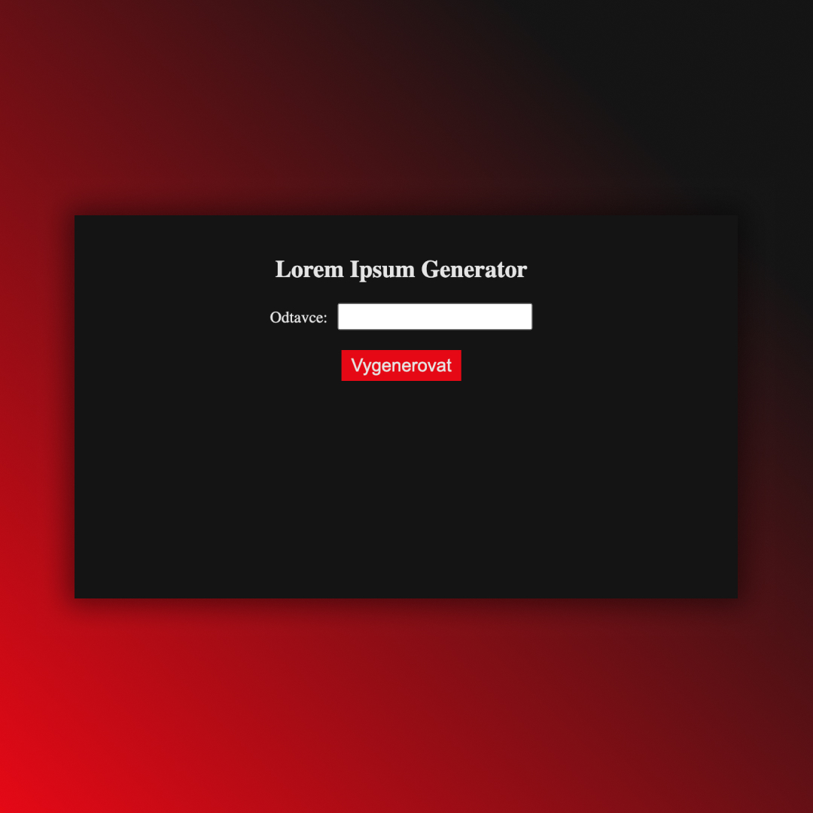

## Lorem Ipsum Generator
• Practicing useState, filter, map, form ✅

## Screenshots 📱

## 💻 Tech Stack

## 🌐 Link
<a href="https://generator-dejvcodes.netlify.app/">Lorem Ipsum Generator</a>

## License🔐
[MIT License](LICENSE)